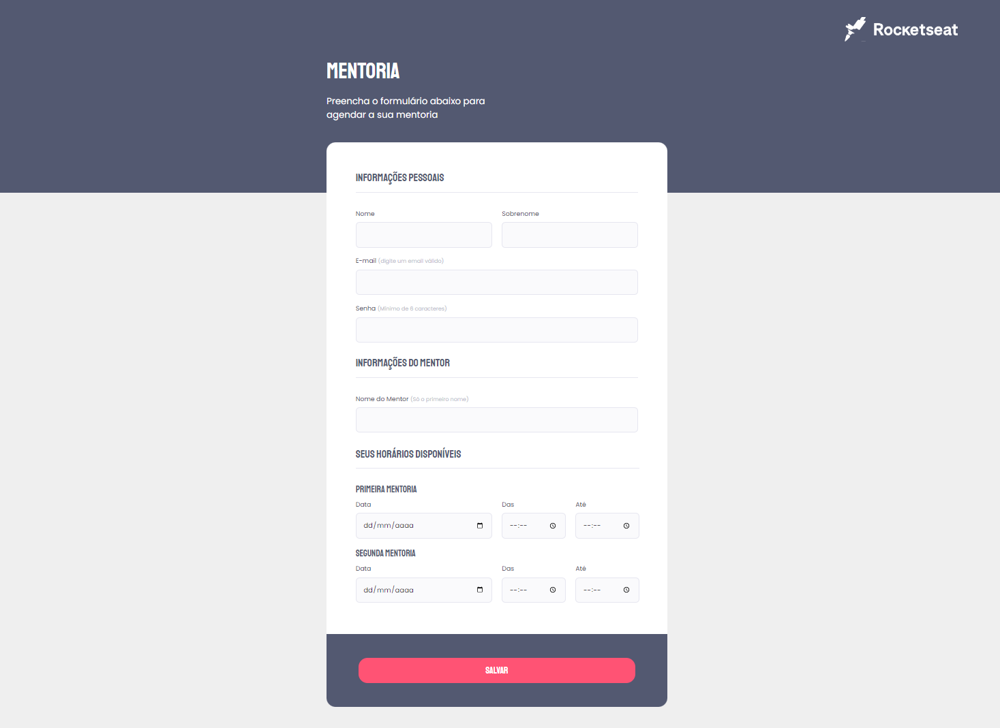

<h1 align="center"> Criando formulários - Intermediário 💜 </h1>

  <a href="#-tecnologias">Tecnologias</a>&nbsp;&nbsp;&nbsp;|&nbsp;&nbsp;&nbsp;
  <a href="#-projeto">Projeto</a>&nbsp;&nbsp;&nbsp;|&nbsp;&nbsp;&nbsp;
  <a href="#-layout">Layout</a>&nbsp;&nbsp;&nbsp;|&nbsp;&nbsp;&nbsp;
  <a href="#memo-licença">Licença</a>

 

  

## 🚀 Tecnologias

Esse projeto foi desenvolvido com as seguintes tecnologias:

- HTML e CSS
- Git e Github
- Figma

## 💻 Projeto

Nesse projeto foi recriado uma aplicação, a partir de um layout pronto no figma, para fortalecer alguns conceitos aprendidos em aula, relacionado a formulários, validaçoes por front-end e customização.

## 🔖 Layout

Você pode visualizar o layout do projeto através [DESSE LINK](<https://www.figma.com/file/LF8WIBR7tQ6NipjklgafMi/Stage-03---Formul%C3%A1rio-intermedi%C3%A1rio-(Copy)?node-id=0%3A1&t=34Ar6r3O24TrVXyM-0>). É necessário ter conta no [Figma](https://figma.com) para acessá-lo.

## :memo: Licença

Esse projeto está sob a licença MIT.

---

Feito com  ♥  by Alex Lima

